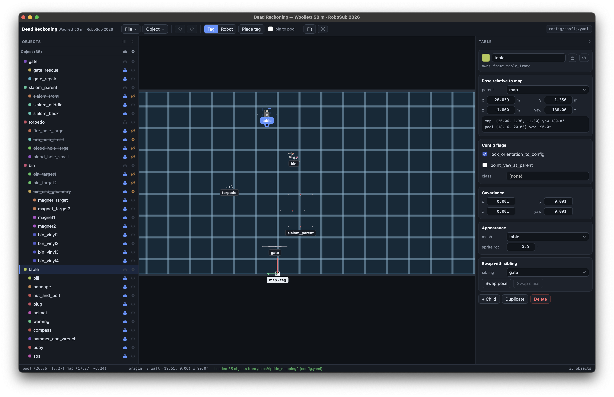

# Dead Reckoning

A top-down 2D editor of the RoboSub competition pool. Place the map origin, drag task props to where they physically sit, and save the result straight into the team's `riptide_mapping` `config.yaml`.

> This app was built on vibes: S/O Claude. It works, but read the source with that in mind.



## Getting started

Grab a build for your platform (macOS `.dmg`, Windows `.msi`, Linux `.deb`/`.rpm`/`.AppImage`) or build one yourself:

```sh
cd app
npm install
npm run tauri:build   # bundles land in app/src-tauri/target/release/bundle/
```

To run it in a browser instead (no install beyond Node ≥ 18):

```sh
cd app
npm install
npm run dev           # → http://localhost:5173
```

On startup the app reopens the last config you had loaded. Use **Open** to load a different `riptide_mapping` `config.yaml`.

## Typical workflow

1. **Open** the team's `config.yaml`. The pool, lane lines, and every prop appear to scale.
2. **Place the map origin.** Two modes (Scene inspector):
   - **AprilTag** — click a bottom-line/wall intersection; the tag snaps there and faces into the pool.
   - **Robot frame** — for runs where the origin is the sub's start pose. Place it anywhere and drag/rotate freely.
3. **Position the props.** Drag a prop to move it (its children ride along rigidly), drag the blue handle to rotate, or type an exact pose in the inspector. Props with `parent ≠ map` start **locked** so the big assemblies move as a unit, unlock from the objects list when you need to adjust a child.
4. **Read the numbers.** The inspector and objects list show each prop's pose relative to its parent (exactly what the config stores), plus its map-frame and pool coordinates — all live.
5. **Save.** The config is written with comments, ordering, and unrelated sections untouched.

Handy extras: **Swap with sibling** exchanges the poses of two props under the same parent (e.g. the two gate sides), and **Swap class** flips a bin vinyl between fire and blood.

## Controls

| Action | Input |
|---|---|
| Move object (subtree follows) | drag |
| Rotate object | drag blue handle, or `Q` / `E` for 1° (`⇧` 15°) |
| Nudge | arrow keys, 1 cm (`⇧` 10 cm) |
| Pan | drag background, or middle-drag |
| Zoom | wheel (about cursor) · double-click zooms to object · `F` fits the pool |
| Lock / hide selected | `L` / `H` |
| Delete / deselect | `Del` / `Esc` |
| Toggle side panels | `[` / `]` (drag inner edge to resize) |

Locked objects are immovable *and* click-through on the canvas (clicks reach the small props sitting on top of them) but stay fully editable from the objects list. Hidden objects also stay in the list. Light and dark themes are in the toolbar; labels can show roots, everything, or nothing.